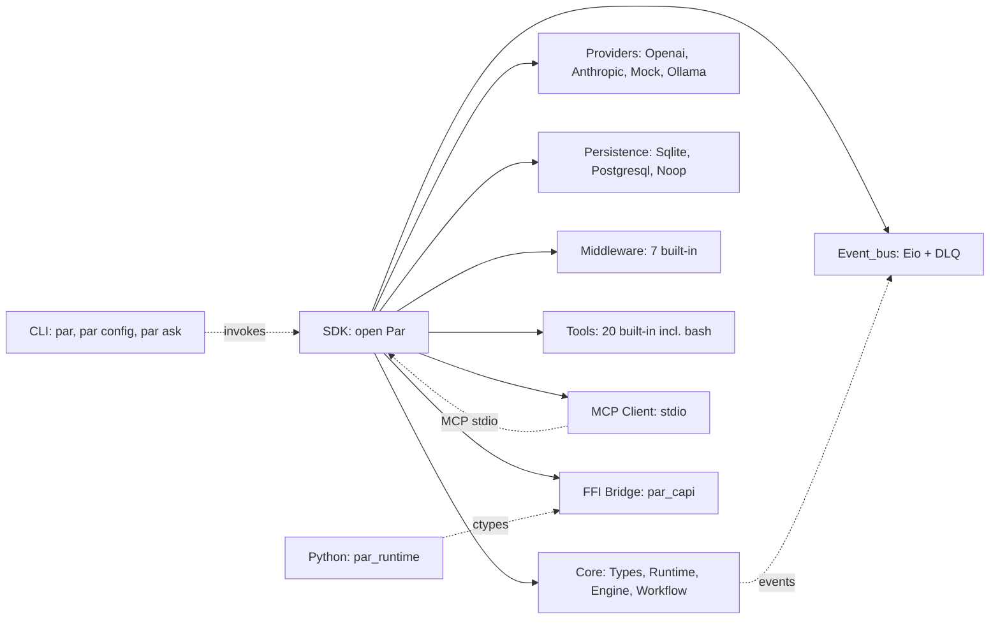

# P-A-R — Programmable Agent Runtime

**English** · [简体中文](docs/zh-CN/README.md)

A modular, type-safe agent runtime for OCaml 5.4+: LangChain + LangGraph for the OCaml ecosystem.

[](https://github.com/jcz2020/par/actions/workflows/ci.yml)
[](LICENSE)
[]()
[]()
[]()

A complete, runnable program that registers a tool, registers an agent, and prints confirmation:

```ocaml
open Par
let config = { Types.persistence = `Sqlite "par.db";
  event_bus = Runtime.default_event_bus_config;
  default_quota = Runtime.default_quota;
  shutdown = Runtime.default_shutdown_config;
  llm_providers = [];
  eval_limits = { max_depth = 10; max_node_visits = 1000 };
  parallel_tool_execution = true; }
let () = Eio_main.run (fun _env ->
  Eio.Switch.run (fun switch ->
    match Runtime.create ~config switch with
    | Error e -> Printf.eprintf "Failed: %s\n" (Runtime.string_of_error_category e)
    | Ok rt -> let tool = Runtime.register_tool rt
        ~name:"echo" ~description:"Echoes back the input"
        ~input_schema:(`Assoc [("type", `String "object"); ("properties", `Assoc [])])
        ~handler:(fun input _ -> Types.Success (`String (Printf.sprintf "Echo: %s" (Yojson.Safe.to_string input)))) () in
      let agent = { Types.id = "echo-agent";
        system_prompt = "You are an echo assistant."; system_prompt_template = None;
        model = { provider = `Openai; model_name = "gpt-4"; api_base = None;
                  temperature = 0.7; max_tokens = None; top_p = None; stop_sequences = None };
        tools = [ tool.descriptor ]; max_iterations = 5; middleware = [];
        retry_policy = None; context_strategy = None; resource_quota = None; } in
      ignore (Runtime.register_agent rt agent);
      Printf.printf "Agent registered: %s\n" agent.id;
      ignore (Runtime.close rt)))
```

## Why PAR?

| Aspect | LangChain (Python) | pi-agent-core (TypeScript) | PAR (OCaml) |
|--------|--------------------|---------------------------|-------------|
| Type safety | Runtime crashes | Compile errors | **Compile errors caught by `make build`** |
| Concurrency model | asyncio (callback-prone) | Native Promises | **Eio effects (structured)** |
| Shell safety | `exec` / `subprocess` with raw strings | `child_process` raw strings | **Type-safe ADT (no `Exec_raw_shell` constructor)** |
| Provider count | 50+ (bloat risk) | 5 (LLM-only) | **2 stable + custom-registration guide** |

## Install

**Binary install (recommended, ~5 seconds):**

```bash
curl -fsSL https://raw.githubusercontent.com/jcz2020/par/main/install.sh | bash
```

**Upgrade:**

```bash
par update
```

**Build from source:**

```bash
git clone https://github.com/jcz2020/par.git && cd par
make install
```

For opam-only install: `opam install par par_cli` (once published). The PostgreSQL backend ships as a separate `par_postgres` opam package, install it alongside `par` only when you need production persistence.

## Architecture

PAR is SDK-first. The CLI is a thin consumer of the SDK, not a sibling of it; every CLI command is a small program that calls into `Par.Runtime`. The Python binding reaches the same runtime through the C FFI bridge, which means one implementation serves all three surfaces.



The `par` facade module (`lib/par.ml`) re-exports every public submodule, so a single `open Par` is enough to access the runtime, providers, persistence, middleware, tools, and MCP. The Python binding and the CLI never reach inside the facade; they go through the same public API any other consumer would use.

## Features

### Core SDK

- ReAct agent loop with bounded iterations, middleware hooks at every LLM and tool boundary.
- Workflow engine with sequential, parallel, conditional, and map-reduce step types plus checkpoints.
- Multi-provider LLM: `` `Openai ``-compatible chat completions, `` `Anthropic `` Messages API, plus an `` `Ollama `` provider for local models and a `` `Mock `` provider for deterministic tests.
- MCP stdio client: connect any Model Context Protocol server for tools, resources, and prompts; the runtime spawns and stops the child process for you.

### Concurrency and Persistence

- OCaml 5.4 effects with Eio structured concurrency; no orphan fibers, no callback pyramids.
- 7 built-in middleware: `Logging`, `Retry`, `Rate_limit`, `Timeout`, `Arg_validation`, `Validation`, `Pii_mask`, `Sanitize_tool_output`.
- Dual persistence: `` `Sqlite `` for development (zero-config file backend), `` `Postgresql `` for production (shipped as the separate `par_postgres` opam package), and `` `Noop `` for ephemeral in-memory tests. Configurable DLQ via `event_bus.max_queue_size` and `dlq_enabled`, with a per-runtime cap on `default_quota.max_concurrent_tasks`.

### Tools and Ecosystem

- 20 built-in tools, including the type-safe `bash` tool: `Bash_safe_command` ADT, `Bash_policy` functor, 31-entry `Bash_blacklist`, and `Bash_invoked` / `Bash_completed` event types. Shell injection is unrepresentable in the type layer.
- C FFI plus a Python binding: the `par_runtime` package exposes the same runtime over ctypes, thread-safe, with its own `pytest` suite.
- 871 OCaml tests and 16 Python tests passing; zero regressions across the v0.3 series.
- MIT-licensed, 100% open source, dual distribution via opam and PyPI.

## SDK Quick Start

The hero example above does four things in order. Each step is small enough to read on its own.

1. `Runtime.create` returns `(runtime, error_category) result`. The `Error` arm is real, not a placeholder: pass the error to `Runtime.string_of_error_category` to print a human-readable category, and to `Types.error_category_to_yojson` for structured logging. The runtime does not retry creation on its own, so the call site decides what to do when persistence or event bus initialization fails.
2. `register_tool` requires `name`, `description`, `input_schema` (a JSON Schema document of type `Yojson.Safe.t`), and a `handler` of type `Yojson.Safe.t -> Cancellation_token.t -> (Yojson.Safe.t, [> string ]) result`. The handler returns `Types.Success` with a JSON value on the happy path, or `Types.Error { category; message; retryable; metadata }` on failure; the middleware chain inspects `category` to decide retry, rate-limit, or PII-mask behavior.
3. `register_agent` takes a full `agent_config` record, including `model`, `tools`, `max_iterations`, and `middleware`, plus optional `retry_policy`, `context_strategy`, and `resource_quota`. The same record drives the ReAct loop, the workflow engine, and the event bus, so there is one source of truth for what an agent is.
4. `Runtime.close` shuts down the runtime, stops every MCP server child, drains the event bus, and closes the persistence backend. The returned integer is the exit code; a non-zero value means a child process refused to exit cleanly.

The `parallel_tool_execution` flag on `runtime_config` toggles whether the ReAct loop issues tool calls in parallel within a single iteration. Leave it `true` for read-only tools and `false` for tools that mutate shared state.

### Custom LLM Providers

The four built-in providers cover most teams, but the `Custom` constructor of `model_config` accepts any OpenAI-compatible or Anthropic-compatible endpoint. To register a custom provider, set `api_base` on the `model_config` to the upstream URL, and add an `llm_providers` entry in the runtime config with the right `request_format`. Cohere, Mistral, vLLM, llama.cpp's server mode, and any in-house gateway all work the same way. The reference walkthrough lives in [docs/howto/custom-llm-provider.md](docs/howto/custom-llm-provider.md).

### Error Categories

`error_category` is the one type every SDK caller eventually has to handle. The full set is: `Internal`, `Invalid_input`, `External_failure`, `Timeout`, `Rate_limited`, `Permission_denied`. A well-behaved handler maps each variant to a recovery policy: `Rate_limited` triggers a backoff, `Timeout` cancels the in-flight call, `Permission_denied` surfaces a user-facing error, and `External_failure` decides retry based on the `retryable` flag. The retry policy lives on the agent, not on the handler, so a single retry decision governs every tool call in an iteration.

### Concurrency Model

PAR uses Eio effects, not preemptive threads. Every `Runtime.invoke` runs inside a fiber, and every tool call runs in a child fiber; if the parent fiber cancels, every child fiber is cancelled in the same tick, and the cleanup runs through `Eio.Switch.on_release` callbacks. There is no thread pool to size and no semaphore to leak. The trade-off is that long blocking calls (such as synchronous `read` of a slow socket) must be wrapped with `Eio.Switch.run` so the runtime can interrupt them, but the wrap is mechanical and the type system makes missing it a compile error in agent code that uses the SDK helpers.

For the common case, you do not write any concurrency code yourself: the ReAct loop is single-fiber, the workflow engine parallelizes across steps via a `default_quota.max_concurrent_tasks` cap, and MCP server calls are spawned on demand. The concurrency model is something you reach for when you need it, not something you must design around from the first line.

## MCP Client

PAR can connect to any Model Context Protocol (MCP) server, letting an agent call external tools, read resources, and render prompts. The runtime spawns the server as a child process over stdio, performs the `initialize` handshake, and surfaces the server through the typed `Mcp_client` API. The seven event types `Mcp_server_started`, `Mcp_server_failed`, `Mcp_server_stopped`, `Mcp_tool_invoked`, `Mcp_tool_completed`, `Mcp_resource_read`, and `Mcp_prompt_rendered` let you observe every transition.

```ocaml
open Par

let mcp_config = {
  Mcp_types.name = "filesystem";
  command = "npx";
  args = ["-y"; "@anthropic/mcp-server-filesystem"; "/tmp"];
  env = [];
  cwd = None;
  startup_timeout = 10.0;
}

let () = Eio_main.run (fun env ->
  Eio.Switch.run (fun switch ->
    match Runtime.create
      ~mcp_servers:[mcp_config]
      ~mcp_process_mgr:(Eio.Stdenv.process_mgr env)
      ~mcp_clock:(Eio.Stdenv.clock env)
      ~config switch
    with
    | Error e -> Printf.eprintf "Failed: %s\n" (Runtime.string_of_error_category e)
    | Ok rt ->
      (* MCP server is now running; fetch the client handle by id *)
      let result = Runtime.mcp_server rt "filesystem" in
      (match result with
       | Ok server ->
         let tools = Mcp_client.list_tools (Mcp_client.of_server server) in
         (match tools with
          | Ok tool_list ->
            Printf.printf "MCP server has %d tools\n" (List.length tool_list)
          | Error e ->
            Printf.eprintf "list_tools failed: %s\n" (Runtime.string_of_error_category e))
       | Error e ->
         Printf.eprintf "Server not found: %s\n" (Runtime.string_of_error_category e));
      ignore (Runtime.close rt)
  )
)
```

See [`docs/sdk/mcp.md`](docs/sdk/mcp.md) for the full reference: `startup_policy`, `mcp_servers` lifecycle, typed `call_tool` / `read_resource` / `get_prompt` calls, and the security checklist for adding a new server.

### MCP Event Types

The event bus emits one event per MCP transition, so a monitoring integration never has to poll. The seven types and their triggers:

- `Mcp_server_started`: server `initialize` handshake completed.
- `Mcp_server_failed`: spawn failed, handshake failed, or the child crashed.
- `Mcp_server_stopped`: clean shutdown via `Runtime.close` or `disconnect`.
- `Mcp_tool_invoked`: `call_tool` entry, before the server returns.
- `Mcp_tool_completed`: `call_tool` exit, with `duration_ms` for latency tracking.
- `Mcp_resource_read`: `read_resource` succeeded, carries the URI.
- `Mcp_prompt_rendered`: `get_prompt` succeeded, carries the prompt name.

Subscribe to all seven with `Event_bus.subscribe` on the runtime's bus. The recommended production pattern is to feed `Mcp_server_failed` into a counter and `Mcp_tool_completed.duration_ms` into a P99 histogram; both wire directly into standard observability backends.

### MCP Security Checklist

Adding a new MCP server is a trust decision, not a config edit. Before promoting a `server_config` to production, verify that `command` points to a trusted absolute path (shell injection is impossible, but a relative path is ambiguous), that `args` contains no secrets (the values appear in `ps` output), and that `env` does not pass API tokens. Write secrets to disk and let the server read them. Choose `Fail_fast` startup policy for required servers, and `Log_and_continue` for optional ones such as a linter. The full checklist with rationale lives at the bottom of [`docs/sdk/mcp.md`](docs/sdk/mcp.md).

## Python Binding

PAR ships a Python binding via ctypes, package name `par_runtime`. The C ABI lives in `par_capi.so`; the Python wrapper calls into it directly, so there is no GIL contention with the OCaml runtime and no separate process to coordinate.

```bash
# Build the shared library
dune build lib/ffi/par_capi.so

# Run Python tests
cd bindings/python && python3 -m pytest tests/
```

```python
import json
from par_runtime import Runtime

config = json.dumps({
    "persistence": {"tag": "sqlite", "contents": ":memory:"},
    "event_bus": {"max_queue_size": 100, "dlq_enabled": False, "dlq_max_size": 10},
    "default_quota": {"max_tokens": 4096, "max_iterations": 10, "timeout_seconds": 30.0},
    "shutdown": {"grace_period_seconds": 5.0, "force_after_seconds": 10.0},
    "llm_providers": [],
    "eval_limits": {"max_depth": 10, "max_node_visits": 1000},
})

with Runtime(config) as rt:
    rt.register_tool("echo", "Echo tool", '{"type": "object"}')
    # result = rt.invoke("my-agent", "Hello!")  # requires LLM provider
```

See `bindings/python/examples/basic_agent.py` for the full example, and `bindings/python/tests/` for the 16-test pytest suite that exercises persistence, middleware, and the FFI surface.

## CLI Reference

The CLI is the SDK's end-user surface. For production code, use the SDK directly. The CLI exists so non-engineers can drive an agent without writing OCaml, and so engineers can smoke-test a config before wiring it into a service.

| Command | Description |
|---------|-------------|
| `par` | Interactive REPL, reads `~/.par/config.json`, no arguments required |
| `par config` | Configure provider, API key, and model with a guided wizard |
| `par ask "question"` | Single-shot query, prints the answer and exits |
| `par update` | Check for updates and update par to the latest version |
| `par --version` | Print the installed `par` and `par_cli` versions |

All commands accept the same optional overrides: `--provider`, `--api-key`, `--model`, `--persistence`, `--db-uri`, `--temperature`, `--max-iterations`, `--max-tokens`, `--top-p`, `--no-parallel-tools`. The override flags win over the config file, and the config file wins over the compiled-in defaults.

## Documentation

The full documentation index is at [`docs/index.md`](docs/index.md). It is organized using the Diataxis framework: tutorial, how-to, reference, explanation.

### Tutorial

- [Quickstart](docs/quickstart.md): 30 minutes from install to a working agent with tool calls.

### How-to

- [Concurrency](docs/howto/concurrency.md): 3 layers of concurrency, runtime, fiber, and tool.
- [Custom LLM Provider](docs/howto/custom-llm-provider.md): register Cohere, Mistral, Ollama, or any OpenAI-compatible endpoint.
- [Error Handling](docs/howto/error-handling.md): `error_category` classification, recovery strategies, event-bus audit.

### Reference

- [Agent API](docs/sdk/agent.md): `agent_config`, `model_config`, `Runtime.invoke`, tool handler signature.
- [Workflow API](docs/sdk/workflow.md): step types, checkpoints, conditional and map-reduce.
- [Middleware](docs/sdk/middleware.md): 7 built-in middleware plus how to write your own.
- [Tools](docs/sdk/tools.md): all 20 built-in tools, including the type-safe `bash` tool.
- [MCP Client](docs/sdk/mcp.md): `Mcp_client`, `Mcp_server`, and `Mcp_types` APIs plus the event list.

### Explanation

- [Architecture](docs/explanation/architecture.md): how PAR works internally, modules, data flow, type system, concurrency.

## Built-in Tools

PAR ships 20 built-in tools. Every tool is registered through the same `Runtime.register_tool` API, so a custom tool you write is indistinguishable from a built-in as far as the agent is concerned.

| Tool | Description |
|------|-------------|
| `bash` | Type-safe shell execution (v0.3.1). `argv` is a `string list`, no `Exec_raw_shell` constructor. |
| `calculator` | Evaluate arithmetic expressions: `+`, `-`, `*`, `/`, parentheses. |
| `get_time` | Current UTC date and time in ISO 8601. |
| `echo` | Echo the input text back to the caller. |
| `generate_uuid` | Generate a random UUID v4. |
| `hash_text` | Hash text with MD5, SHA1, or SHA256 (default SHA256). |
| `generate_password` | Random password, configurable length and symbol set. |
| `string_stats` | Count characters, words, and lines. |
| `json_format` | Validate and pretty-print a JSON string. |
| `convert_temperature` | Convert between Celsius, Fahrenheit, and Kelvin. |
| `url_encode` | URL-encode or URL-decode a string. |
| `fetch_url` | HTTP GET with TLS verification, 10MB cap, 50kB default text return. |
| `read_webpage` | Fetch, parse, and extract readable text; strips `script`, `style`, `noscript`. |
| `web_search` | DuckDuckGo search, returns up to 20 results with title, URL, snippet. |
| `read` | Read a file relative to CWD, with offset and limit; up to 10MB. |
| `ls` | List directory entries with type, size, and mtime. |
| `find` | Find files matching a glob pattern, skips `.git`, `node_modules`, `_build`. |
| `grep` | Regex search across files, optional glob filter, 30s timeout. |
| `write` | Write content to a file, optional `create_dirs` flag. |
| `edit` | Apply a batch of exact-string edits, rejects overlapping ranges. |

## Module Reference

| Package | Description |
|---------|-------------|
| `par` | SDK: core types, ReAct engine, runtime, workflow, expression evaluator, state machine, context manager, event bus, OpenAI and Anthropic providers, SQLite persistence, 20 built-in tools, MCP stdio client, 7 middleware. PostgreSQL ships separately as `par_postgres`. |
| `par_cli` | CLI tool: `par` (REPL), `par config` (wizard), `par ask` (single-shot). Built on top of the SDK, not parallel to it. |
| `par_runtime` | Python ctypes binding, thread-safe, ships a `pytest` suite. |
| `par_postgres` | Optional PostgreSQL persistence backend, separate opam package. |

## Project Structure

```
par/
+-- bin/              CLI entry point (par, par config, par ask)
+-- lib/
|   +-- core/          Types, Runtime, Engine, SDK, Expression, State machine, Workflow, Context manager, Cancellation
|   +-- providers/     OpenAI and Anthropic LLM providers
|   +-- persistence/   SQLite backend + Noop fallback
|   +-- postgres/      Optional PostgreSQL backend (separate dune library, par_postgres)
|   +-- event_bus/     Eio-based event bus with DLQ
|   +-- middleware/    Logging, Retry, Rate_limit, Timeout, Arg_validation, Validation, Pii_mask, Sanitize_tool_output
|   +-- tools/         20 builtin tools (calculator, web tools, file ops, bash in v0.3.1)
|   +-- mcp/           MCP stdio client (Mcp_types, Mcp_server, Mcp_client, Mcp_transport_stdio, Mcp_naming, Mcp_errors)
|   +-- ffi/           C FFI bridge (par_ffi.h, par_ffi.c, par_capi.ml)
|   +-- par.ml         Facade module (re-exports all sub-modules for `open Par`)
+-- bindings/
|   +-- python/        Python ctypes binding (par_runtime package)
|       +-- par_runtime/     Runtime, errors, FFI declarations
|       +-- tests/           16 pytest tests
|       +-- examples/        basic_agent.py
+-- test/              867 OCaml unit and integration tests
+-- examples/          Example agents and workflows (basic_agent, otel_tracing, ...)
+-- schema/            Database schemas
+-- docs/              User documentation (quickstart, CLI ref, SDK ref, how-to, explanation)
```

## Dependencies

Runtime: OCaml 5.4+, dune 3.23+, `cohttp-eio`, `lambdasoup`, `tls-eio`, `ca-certs`, `caqti-eio`, `sqlite3`. CLI extras: `cmdliner`, `eio_main`. Python binding: `par_capi.so` plus `par_runtime` (ctypes only, no compiler needed at install time). Optional: `postgresql` for the `par_postgres` opam package.

All runtime dependencies are pinned in `dune-project` and propagated to the generated `par.opam` and `par_cli.opam` files. To install the dev dependencies for running the test suite locally, run `opam install . --deps-only --with-test` from the repo root. The `make install` target wraps this for the common case, and also builds the C ABI shared library that the Python binding loads at import time.

## Project Size

- 867 OCaml tests and 16 Python tests passing.
- Approximately 10,600 lines of OCaml in `lib/` plus 770 lines of Python in `bindings/python/`.
- The largest single file is `lib/tools/builtin_tools.ml` at roughly 1,300 lines, dominated by the 20 tool handlers and the HTTP stack that backs `fetch_url`, `read_webpage`, and `web_search`. The SDK facade (`lib/par.ml`) is intentionally small: it re-exports submodules and adds no logic of its own.

## License: MIT

PAR is released under the MIT License. See [LICENSE](LICENSE) for the full text. You can use it in commercial products, modify it, and ship it; the only requirement is to keep the copyright notice.

## Acknowledgements

PAR stands on the shoulders of several OCaml projects. The build system is `dune` from the ocaml/dune team. The concurrency model is Eio, from the ocaml-multicore/eio team. The HTTP and TLS stack comes from mirage/ocaml-cohttp and the tls-eio maintainers. The workflow design owes a debt to elixir-plug/plug, which proved that a small, composable middleware pipeline can replace a sprawling framework. The agent-loop shape and the tool/agent abstractions are inspired by langchain-ai/langchain and the broader LangGraph community, adapted to the OCaml type system. Thanks to every maintainer of the libraries PAR depends on.

Special thanks go to the vllm-project/vllm team for publishing inference-server patterns that informed the `Custom` provider design, and to the maintainers of aantron/dream for showing how a small, well-typed OCaml binding can outlive its original use case. PAR's Python ctypes surface draws on the same minimalism: one C ABI, one Python wrapper, no extra process.

## See also

- [docs/DOC-MAINTENANCE.md](docs/DOC-MAINTENANCE.md): how PAR keeps public docs and internal docs separate, and what the CI checks.
- [CONTRIBUTING.md](CONTRIBUTING.md): contributor guide, dev setup, PR conventions.
- [CHANGES.md](CHANGES.md): version history, with the test count captured at every release.
- [docs/quickstart.md](docs/quickstart.md): 30-minute tutorial that walks the hero example above end to end, with provider configuration and a first tool call.
