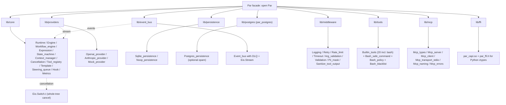

<!-- language: en -->

# PAR SDK Overview

The PAR SDK is an OCaml 5.4+ library for building LLM-powered agents. It provides a ReAct reasoning loop, multi-provider LLM abstraction, type-safe shell execution, MCP stdio client integration, and a 7-middleware pipeline. This overview is the deep dive; the README is the landing.

## What is the PAR SDK?

PAR (Programmable Agent Runtime) ships as two opam packages. `par` is the SDK; `par_cli` is a thin CLI that exercises the SDK for end users. The SDK is the production surface. Anything you can do via the CLI, you can do programmatically through `Par.Runtime.*` functions.

- Two opam packages: `par` (SDK) and `par_cli` (CLI)
- 9 sub-libraries under `lib/` plus a facade module `Par` (re-exports all sub-modules)
- 20 built-in tools including the type-safe `bash` tool
- 7 built-in middlewares (logging, retry, rate-limit, timeout, input validation, PII mask, tool-output sanitization)
- Multi-provider: OpenAI compatible + Anthropic Messages API + custom registration
- 666 OCaml tests + 16 Python tests passing

## Architecture at a glance



The facade `Par` is the single import surface: `open Par` brings every sub-module listed above into scope, so call sites read `Par.Runtime.invoke` only when they want to disambiguate from a local `Runtime` name. The dashed edges are the cross-cutting concerns: cancellation flows from `Eio.Switch.t` into every tool handler, the event bus feeds observability back into the runtime, and provider streaming responses drive the ReAct loop in `Engine.run_agent`.

## Five-minute SDK tour

Five self-contained examples, one per subsystem. Each compiles against the published `par` opam package.

### 1. Runtime + tool

Create a runtime, register a tool, register an agent. The handler receives JSON input and a cancellation token, returns a typed `handler_result`.

```ocaml
open Par

let config = {
  Types.persistence = `Sqlite "par.db";
  event_bus = Runtime.default_event_bus_config;
  default_quota = Runtime.default_quota;
  shutdown = Runtime.default_shutdown_config;
  llm_providers = [];
  eval_limits = { max_depth = 10; max_node_visits = 1000 };
  parallel_tool_execution = true;
}

let () = Eio_main.run (fun _env ->
  Eio.Switch.run (fun switch ->
    let rt = Runtime.create ~config switch |> Result.get_ok in
    let tool = Runtime.register_tool rt ~name:"echo"
      ~description:"Echoes back the input"
      ~input_schema:(`Assoc ["type", `String "object";
                              "properties", `Assoc []])
      ~handler:(fun input _token ->
        Types.Success (`String (Printf.sprintf "Echo: %s"
          (Yojson.Safe.to_string input))))
      () |> Result.get_ok in
    ignore (Runtime.register_agent rt
      { id = "echo-agent"; system_prompt = "You are an echo assistant.";
        system_prompt_template = None;
        model = { provider = `Openai; model_name = "gpt-4"; api_base = None;
                  temperature = 0.7; max_tokens = None; top_p = None;
                  stop_sequences = None };
        tools = [tool.descriptor]; max_iterations = 5;
        middleware = []; retry_policy = None; context_strategy = None;
        resource_quota = None }))
```

### 2. LLM invoke

Once an agent is registered, `Runtime.invoke` runs the ReAct loop until the LLM signals `Stop`, all tool calls return, or `max_iterations` is reached.

```ocaml
match Runtime.invoke ~agent_id:"echo-agent" ~message:"Hello!" rt with
| Ok resp -> Printf.printf "Response: %s\n"
    (Option.value resp.Types.text ~default:"(no text)")
| Error err -> Printf.eprintf "Error: %s\n"
    (Yojson.Safe.to_string (Types.error_category_to_yojson err))
```

Pass `?cancellation_token:` to abort a long-running invoke; the cancellation propagates to every tool handler through the Eio switch. Full signature and `error_category` variants live in [`agent.md`](agent.md).

### 3. Event subscription

Subscribe to the event bus and pattern-match on lifecycle events. MCP server events arrive on the same bus as task and tool events, so one subscriber covers the whole runtime.

```ocaml
let bus = Runtime.bus rt in
Event_bus.subscribe bus (fun ev ->
  match ev with
  | Mcp_tool_completed { server_id; tool_name; duration_ms } ->
    Printf.printf "[mcp] %s/%s done in %.1fms\n"
      server_id tool_name duration_ms
  | Bash_invoked { argv; risk; _ } ->
    Printf.printf "[bash] risk=%s argv=%s\n"
      risk (String.concat " " argv)
  | _ -> ())

ignore (Runtime.invoke ~agent_id:"echo-agent" ~message:"hi" rt)
```

### 4. Workflow

A workflow is a tree of steps: agent calls, tool calls, parallel, sequential, conditional, map-reduce, human approval, and sub-workflow. The runtime submits a workflow definition and returns a `Workflow_run_id.t` for status queries.

```ocaml
let wf = {
  Types.id = "research"; Types.name = "Research and Summarize";
  Types.version = 1;
  Types.steps = Sequential [
    Agent_call { agent_id = "researcher";
                 prompt_template = "Research: {{topic}}" };
    Human_approval { prompt_template = "Approve summary of {{topic}}?";
                     timeout = 60.0; allowed_roles = ["admin"] };
    Agent_call { agent_id = "summarizer";
                 prompt_template = "Summarize: {{topic}}" } ];
  Types.variables = [("topic", `String "OCaml 5 effects")];
  Types.failure_policy = Fail_fast;
  Types.parallel_limit = 3; Types.timeout = 600.0;
  Types.on_complete = None;
} in
ignore (Runtime.register_workflow rt wf);
let run_id = Runtime.submit_workflow rt wf |> Result.get_ok in
ignore (Runtime.approve_workflow rt run_id ~approver:"alice")
```

Reference: [`workflow.md`](workflow.md) covers checkpointing, resume, and the full step taxonomy.

### 5. MCP client

Pass MCP server configs to `Runtime.create`; the runtime spawns each child, completes the initialize handshake, and hands back a `Runtime` whose `mcp_server` accessor returns a typed client handle.

```ocaml
let mcp_fs : Mcp_types.server_config = {
  name = "fs"; command = "npx";
  args = [ "-y"; "@modelcontextprotocol/server-filesystem"; "/tmp" ];
  env = []; cwd = None; startup_timeout = 10.0;
}

let () = Eio_main.run (fun env ->
  Eio.Switch.run (fun sw ->
    let mgr = Eio.Stdenv.process_mgr env in
    let clock = Eio.Stdenv.clock env in
    let rt = Runtime.create
      ~mcp_servers:[mcp_fs] ~mcp_process_mgr:mgr ~mcp_clock:clock
      ~config sw |> Result.get_ok in
    let sid = Mcp_types.server_id_of_string "fs" |> Result.get_ok in
    let client = Mcp_client.of_server
      (Runtime.mcp_server rt sid |> Result.get_ok) in
    match Mcp_client.list_tools client with
    | Ok tools -> List.iter (fun t ->
        Printf.printf "- %s\n" t.Mcp_types.name) tools
    | Error _ -> ())
```

The seven MCP event types (started, failed, stopped, tool invoked, tool completed, resource read, prompt rendered) all flow through the same event bus shown in tour step 3. Reference: [`mcp.md`](mcp.md).

## When to use the SDK vs the CLI

The CLI is a thin exercise of the SDK, so anything the CLI can do, the SDK can do in code. The split is about ergonomics: the CLI favors the person typing a one-shot question; the SDK favors the person embedding PAR in another system.

| Use case | SDK | CLI |
|---|---|---|
| Production agent serving web traffic | recommended | not designed for it |
| Ad-hoc LLM question from terminal | Possible but verbose | `par ask "..."` |
| Reproducible batch jobs | `Runtime.invoke` in a script | REPL is interactive |
| Custom UIs (web, Slack, IDE plugin) | embed the SDK | not applicable |
| Trying PAR for the first time | Possible but heavy setup | `par config` then `par` |
| Multi-agent orchestration with workflows | register and `submit_workflow` | not exposed |
| MCP server integration in your app | pass `~mcp_servers` to `Runtime.create` | not exposed |
| Long-running event monitoring | subscribe to `Event_bus` in-process | pipe logs |

The CLI ships as a separate opam package (`par_cli`) so consumers of `par` do not pull in `cmdliner` and the REPL dependencies.

## Module map

Every public module lives under one of the 9 sub-libraries below, plus the facade in `lib/par.ml`. `open Par` re-exports the marked modules; unmarked modules are still addressable as `Par.<Module>`.

| Library | Public modules (excerpt) | Purpose |
|---|---|---|
| `lib/core` | `Par.Types`, `Par.Runtime`, `Par.Engine`, `Par.Workflow_engine`, `Par.Expression`, `Par.State_machine`, `Par.Context_manager`, `Par.Cancellation`, `Par.Tool_registry`, `Par.Template`, `Par.Steering_queue`, `Par.Hook`, `Par.Metrics` | Core types, runtime, ReAct loop, workflow, expression evaluator, state machine, context manager, cancellation tokens, tool registry |
| `lib/providers` | `Par.Openai_provider`, `Par.Anthropic_provider`, `Par.Mock_provider` | LLM provider implementations |
| `lib/persistence` | `Par.Sqlite_persistence`, `Par.Noop_persistence` | Sqlite backend (dev), no-op (tests) |
| `lib/postgres` | (separate `par_postgres` opam package) | PostgreSQL backend (prod) |
| `lib/event_bus` | `Par.Event_bus` | Eio-based event bus with DLQ |
| `lib/middleware` | `Par.Logging`, `Par.Retry`, `Par.Rate_limit`, `Par.Timeout`, `Par.Arg_validation`, `Par.Validation`, `Par.Pii_mask`, `Par.Sanitize_tool_output` | 7 built-in middlewares |
| `lib/tools` | `Par.Builtin_tools`, `Par.Bash_safe_command`, `Par.Bash_policy`, `Par.Bash_blacklist` | 20 built-in tools + the type-safe bash tool |
| `lib/mcp` | `Par.Mcp_types`, `Par.Mcp_server`, `Par.Mcp_client`, `Par.Mcp_transport_stdio`, `Par.Mcp_naming`, `Par.Mcp_errors` | MCP stdio client (v0.3.1) |
| `lib/ffi` | `Par_capi` (build artifact) | C ABI for Python binding |
| `lib/par.ml` | (facade, re-exports above) | `open Par` entry point |
| `bin/` | (CLI entry) | `par`, `par config`, `par ask` |
| `bindings/python/` | `par_runtime` PyPI package | Python ctypes binding |

The facade `Par` is generated by `lib/par.ml`. The CLI binary in `bin/main.ml` is the only consumer of `par_cli`; everything else links against `par` directly.

## Key invariants

The type system enforces five guarantees that would be runtime checks in a less strict language. Each one moves a class of bugs from "ship and discover" to "does not compile".

- The 8-state machine in `Par.State_machine` rejects illegal task transitions at compile time (configurable in the type itself).
- The `Bash_safe_command.command` ADT has no `Exec_raw_shell` constructor; shell injection is unrepresentable.
- The `error_category` sum type forces every error path to be explicitly handled; no untyped exceptions in the public API.
- `Eio.Switch.t` cancellation propagates to every tool handler via `Cancellation_token.t`; `Runtime.close` triggers whole-tree cancel.
- Tool registration surfaces `Error (\`Duplicate_tool)` instead of silently overwriting; tool names are unique by construction.

Together these turn the SDK into a library that fails loudly at the boundary (compile error, typed `Error` variant, `Cancelled` exception) rather than silently at runtime.

## Next steps

- [`docs/sdk/agent.md`](agent.md): primary reference, covers `Runtime.create`, `register_agent`, `register_tool`, the ReAct loop
- [`docs/sdk/workflow.md`](workflow.md): step taxonomy, checkpointing, human approval, JSON workflow format
- [`docs/sdk/mcp.md`](mcp.md): MCP client lifecycle, event types, server naming and isolation
- [`docs/sdk/middleware.md`](middleware.md): all 7 built-in middlewares and the `middleware_hook` shape
- [`docs/sdk/tools.md`](tools.md): all 20 built-in tools with input/output schemas
- [`docs/quickstart.md`](../quickstart.md): 30-minute hands-on for new users
- [`docs/explanation/architecture.md`](../explanation/architecture.md): deep dive on data flow, the Eio model, and event payload schema
- [`CHANGES.md`](../../CHANGES.md): release notes, including the v0.3.1 bash addition and the current test count
